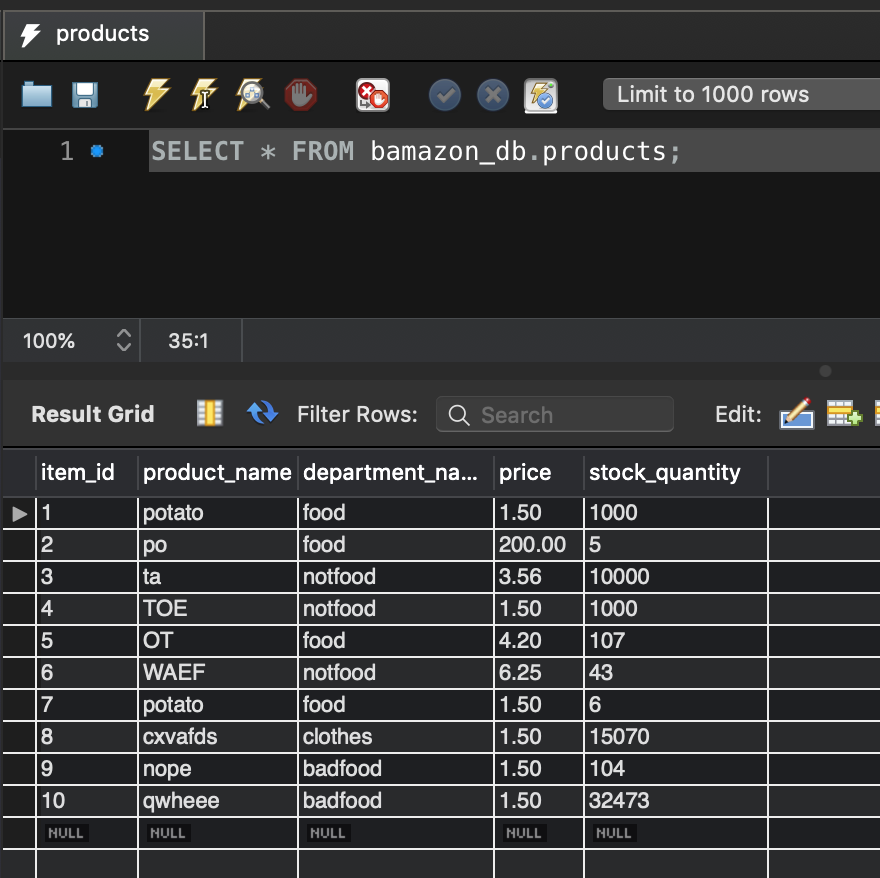
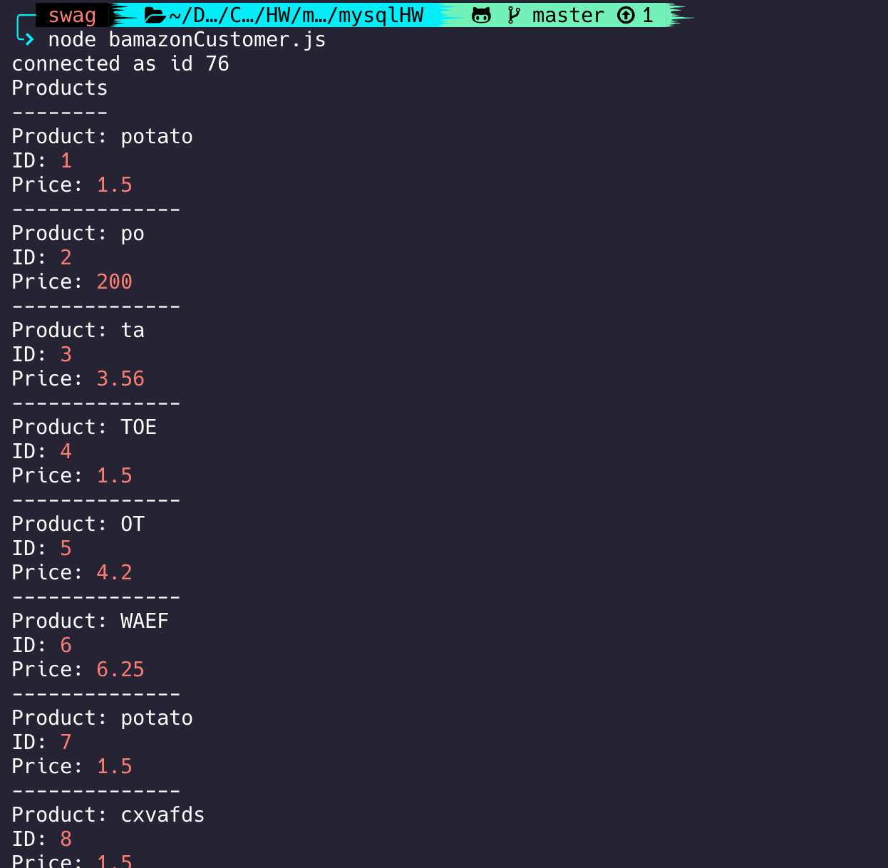
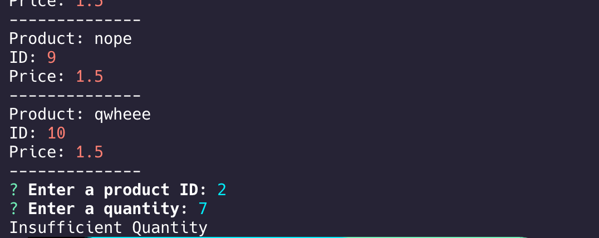
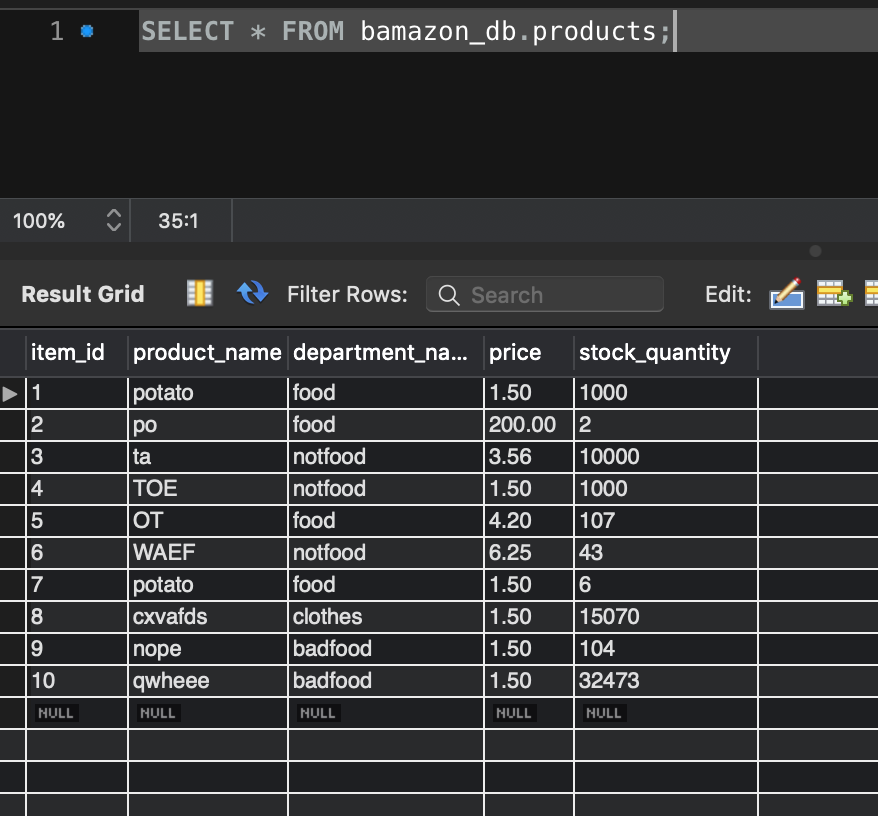

# mysqlHW

SQL CS bootcamp homework with Node

## Meh

### Initial database

### First node call with insufficient quantity output

### Second node call with sucessful purchase

### Updated final database

